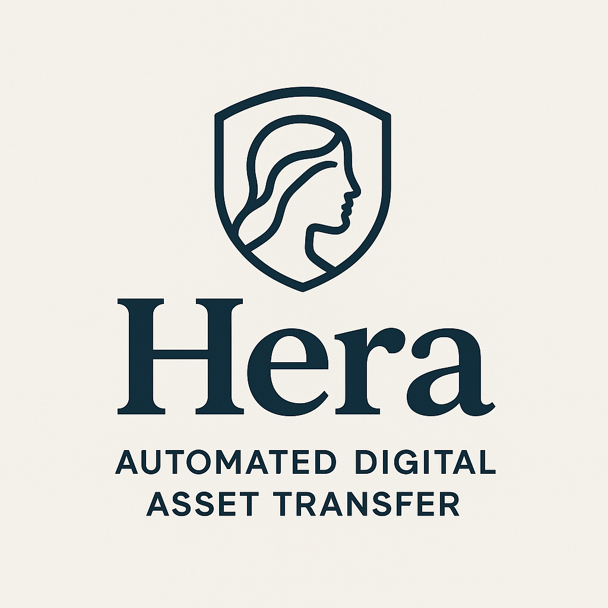

# Welcome to Hera: Where Digital Legacy Meets Blockchain Innovation

<p align="center">
  
</p>

## About Hera

Hera is a pioneering organization revolutionizing digital asset inheritance through blockchain technology. Our mission is to solve one of the most critical challenges in the Web3 ecosystem: ensuring your digital wealth seamlessly transfers to your loved ones when you're no longer around. We leverage smart contracts to create trustless, automated inheritance solutions that eliminate the complexity, cost, and uncertainty of traditional estate planning for cryptocurrency and digital assets.

## The Problem

When someone passes away, accessing their digital assets (cryptocurrency, NFTs) can be a nightmare for heirs. Private keys are lost, and the legal process to gain access is slow, expensive, and often unaware of these assets. Traditional estate planning doesn't account for blockchain-based wealth, leaving billions of dollars potentially inaccessible.

## Our Solution

**Hera** provides a trustless, automated solution for transferring digital assets to designated beneficiaries after a period of inactivity. Using smart contracts, your crypto assets can be seamlessly passed on to your heirs without lawyers, probate courts, or lost keys.

## Our Vision

We envision a future where no digital asset is ever lost due to unforeseen circumstances. A world where families can inherit cryptocurrency and NFTs as seamlessly as traditional assets, secured by the immutable power of blockchain technology and protected by battle-tested smart contracts.

## Key Features

<p align="center">
  
  
  
  
</p>

### 1. **Inheritance Protocol**

Our core smart contract infrastructure powering the digital will system:

- **DigitalWillFactory**: Factory pattern for creating individual digital wills
- **Multi-Asset Support**: ETH, ERC-20 tokens, and ERC-721 NFTs
- **Heartbeat Mechanism**: Automated check-in system to prove activity
- **Emergency Withdraw**: Safety mechanism for grantors to recover assets anytime

### 2. **Hera UI**

Beautiful, user-friendly Web3 interface for managing your digital legacy:

- **Web3Auth Integration**: Seamless wallet connection and authentication
- **Intuitive Dashboard**: Manage assets, beneficiaries, and check-ins
- **Real-time Status**: Track your will's state and remaining time
- **Modern Design**: Built with Next.js and responsive components

### 3. **Smart Contract Security**

Comprehensive test suite ensuring your assets are protected:

- 20+ test files covering all critical functions
- Foundry-based testing framework
- OpenZeppelin security standards
- Pausable and emergency controls

## How It Works

### 1. **Create Your Digital Will**

Deploy your personal DigitalWill smart contract through our factory. This contract becomes your on-chain estate executor.

### 2. **Deposit Assets & Designate Heirs**

- Deposit ETH, ERC-20 tokens, or NFTs into your will
- Specify beneficiary wallet addresses for each asset
- Set allocation percentages or specific amounts per beneficiary

### 3. **Set Your "Heartbeat"**

Configure a check-in period (e.g., 90 days):

- Call the `checkIn()` function regularly to prove you're active
- Each check-in resets the countdown timer
- Fully automated and gas-efficient

### 4. **Automatic Execution**

If you fail to check in after the time limit expires:

- The contract becomes **claimable**
- Designated beneficiaries can trigger asset transfers
- Assets are **instantly and automatically** distributed
- No third-party intervention required

## Why Blockchain for Digital Inheritance?

**✓ Trustless Automation**

- No lawyers, executors, or third parties required
- Smart contracts execute exactly as programmed
- Eliminates human error and manipulation

**✓ Multi-Asset Support**

- ETH (native cryptocurrency)
- ERC-20 tokens (USDC, DAI, WBTC, etc.)
- NFTs (ERC-721 collectibles, domain names, art)
- All in one unified contract

**✓ Privacy & Control**

- Your beneficiaries remain private until execution
- You maintain full control while active
- No public probate process
- Modify beneficiaries anytime

**✓ Instant Execution**

- Assets transfer immediately when conditions are met
- No waiting periods or lengthy legal processes
- Global accessibility 24/7
- Permissionless and censorship-resistant

## Technology Stack

**Smart Contracts**

- Solidity ^0.8.0
- Foundry (Testing & Deployment)
- OpenZeppelin Contracts
- ERC-20 & ERC-721 Standards

**Frontend**

- Next.js 15+ (React Framework)
- TypeScript
- Web3Auth (Authentication)
- ethers.js (Blockchain Interaction)

**Development Tools**

- Foundry (Forge, Cast, Anvil)
- Biome (Linting & Formatting)
- Git Version Control

## Project Structure

```
HeraInc/
├── inheritance-protocol/     # Smart contract infrastructure
│   ├── src/
│   │   └── DigitalWillFactory.sol
│   ├── test/                 # Comprehensive test suite
│   └── script/               # Deployment scripts
│
└── hera-ui/                  # Next.js frontend application
    ├── src/
    │   ├── app/              # Next.js app router
    │   ├── components/       # Reusable UI components
    │   ├── contexts/         # Web3Auth context
    │   └── hooks/            # Custom hooks (useWillContract)
    └── public/               # Static assets
```

## Getting Started

### Smart Contracts

```bash
cd inheritance-protocol

# Install dependencies
forge install

# Run tests
forge test

# Deploy (configure network in foundry.toml)
forge script script/Deploy.s.sol --rpc-url <RPC_URL> --broadcast
```

### Frontend

```bash
cd hera-ui

# Install dependencies
npm install

# Run development server
npm run dev

# Build for production
npm run build
```

Visit to access the Hera UI.

## Get Involved

We're building the future of digital inheritance and welcome contributors, partners, and community members:

- **🤝 Contribute**: Check out our repositories and submit pull requests
- **🔐 Security**: Found a vulnerability? Please report it responsibly
- **💡 Feature Requests**: Have ideas? Open an issue and share your thoughts
- **🌐 Partner**: Explore integration opportunities for wallets, exchanges, or protocols

## Connect With Us

**For business inquiries**: contact@hera.inc  
**For support**: support@hera.inc  
**For security issues**: security@hera.inc

## License

This project is licensed under the MIT License - see the LICENSE file for details.

## Disclaimer

Hera is experimental software. While we've implemented comprehensive testing and security measures, users should conduct their own security audits before depositing significant value. Smart contracts are immutable once deployed - please review all code and documentation carefully.

---

<p align="center">
  <i>Securing your digital legacy, one block at a time.</i>
</p>
